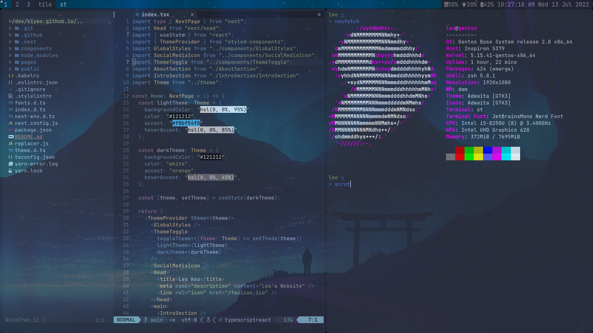

# ⚪ dotfiles




`WARNING: Don’t blindly use my settings unless you know what that entails. Use at your own risk!`

```
bash -c "$(curl -fsSL https://raw.githubusercontent.com/kiyeo/dotfiles/main/install.sh)"
```
### ⬆️ Submodule updates
```
git submodule update --recursive
git submodule foreach git pull origin master
```
### 🗑️ Uninstall dotfiles
```
cd dotfiles &&
  stow -D */
```
### 📋 Clipboard

If using WSL2, execute the following commands:

```
curl -sLo /tmp/win32yank.zip https://github.com/equalsraf/win32yank/releases/download/v0.0.4/win32yank-x64.zip
unzip -p /tmp/win32yank.zip win32yank.exe > /tmp/win32yank.exe
chmod +x /tmp/win32yank.exe
sudo mv /tmp/win32yank.exe /usr/local/bin
```
